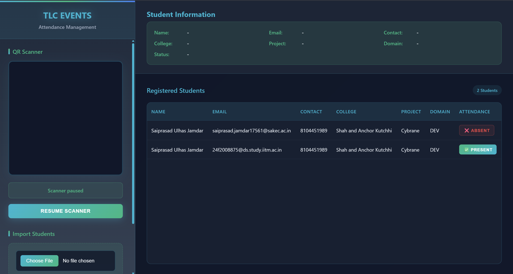

# QR Attendance System

A comprehensive web-based attendance management system built with Django that streamlines student attendance tracking through QR code scanning and Excel integration.

## 🌟 Features

- **📤 Excel Integration**: Import student details from Excel files with support for multiple students per row
- **📷 QR Code Scanning**: Real-time camera-based QR code scanning for automatic attendance marking
- **🧾 Dashboard**: View scanned students and all registered students in one place
- **📧 Email Integration**: Send personalized QR codes to students via email
- **🖱️ Manual Control**: Admin can toggle attendance manually from the dashboard
- **🧠 Smart Parsing**: Auto-parse up to 4 students per row in Excel files

## 🖼️ Screenshots

### Dashboard Overview

*Main dashboard showing student list and attendance status*

### Email QR Code Feature

*Interface for sending QR codes to students via email*

### QR Scan Result

*Example of successful QR code scan with student information*

## 📋 Requirements

- Python 3.10+
- pip
- virtualenv (recommended)
- SQLite (default database - no additional setup required)

## 🚀 Installation & Setup

### 1. Clone the Repository

```bash
git clone https://github.com/your-username/qr-attendance.git
cd qr-attendance
```

### 2. Create Virtual Environment

```bash
python -m venv venv

# Activate virtual environment
# On Linux/macOS:
source venv/bin/activate

# On Windows:
venv\Scripts\activate
```

### 3. Install Dependencies

```bash
pip install -r requirements.txt
```

> **Note**: If `requirements.txt` doesn't exist, generate it using:
> ```bash
> pip freeze > requirements.txt
> ```

### 4. Configure Email Settings

Edit `settings.py` and configure your email settings:

```python
EMAIL_BACKEND = 'django.core.mail.backends.smtp.EmailBackend'
EMAIL_HOST = 'smtp.gmail.com'
EMAIL_PORT = 587
EMAIL_HOST_USER = 'your-email@gmail.com'
EMAIL_HOST_PASSWORD = 'your-app-password'
EMAIL_USE_TLS = True
DEFAULT_FROM_EMAIL = 'your-email@gmail.com'
```

> ⚠️ **Important**: For Gmail, use an **App Password** instead of your regular password.
> Generate one at: Google Account → Security → App Passwords

### 5. Database Setup

```bash
python manage.py makemigrations
python manage.py migrate
```

### 6. Run the Development Server

```bash
python manage.py runserver
```

Visit: [http://127.0.0.1:8000/scan/](http://127.0.0.1:8000/scan/)

## 📂 Project Structure

```
qr-attendance/
│
├── manage.py
├── requirements.txt
├── README.md
├── tlcevent1/              # Django project root
│   ├── settings.py
│   ├── urls.py
│   └── wsgi.py
│
├── qrvalidator/            # Main application
│   ├── models.py
│   ├── views.py
│   ├── urls.py
│   ├── admin.py
│   ├── templates/
│   │   └── scan.html
│   ├── static/
│   │   └── js/
│   │       ├── qr-scanner.min.js
│   │       └── qr-scanner-worker.min.js
│   └── migrations/
│
└── assets/                 # Documentation images
    ├── firstlook.png
    ├── sendqr.png
    └── example.png
```

## 🔌 API Endpoints

| Endpoint | Method | Description |
|----------|--------|-------------|
| `/upload/` | POST | Upload Excel file with student data |
| `/scan/` | GET | Main scanner and dashboard page |
| `/api/student/<uuid>/` | GET | Fetch student details by QR UUID |
| `/api/toggle_attendance/<uuid>/` | POST | Toggle attendance status (admin) |
| `/api/send_qr_emails/` | POST | Send QR codes to all students via email |

## 📊 Excel File Format

The system expects Excel files with the following structure:

- **Headers**: `College`, `Project`, `Domain`, `#Students`
- **Student Data Blocks**: Each row contains data for 2-4 students
- **Student Fields**: `[Name, Email, Contact, Photo]` (Photo is optional)

### Example Excel Structure:
```
College | Project | Domain | #Students | Name1 | Email1 | Contact1 | Photo1 | Name2 | Email2 | Contact2 | Photo2
--------|---------|--------|-----------|-------|--------|----------|--------|-------|--------|----------|--------
ABC College | Project A | Web Dev | 2 | John Doe | john@email.com | 1234567890 | photo1.jpg | Jane Smith | jane@email.com | 0987654321 | photo2.jpg
```

## 🧪 Testing

You can test the system with a sample Excel file like `Creathon.xlsx`. The system will:

1. Parse the Excel file and extract student information
2. Generate unique QR codes for each student
3. Store student data in the database
4. Allow QR scanning for attendance marking

## 🛠️ Troubleshooting

| Issue | Solution |
|-------|----------|
| ❌ Camera not working | Ensure browser permissions are granted for camera access |
| 📧 Emails not sending | Verify SMTP credentials and use App Password for Gmail |
| 🌀 Duplicate entries | System uses email addresses to ensure uniqueness |
| ❓ QR not recognized | Ensure proper UUID string is embedded in QR code |
| 🚫 Permission denied | Check file permissions and virtual environment activation |

## 🔧 Configuration

### Email Configuration
For production, consider using environment variables:

```python
import os
EMAIL_HOST_USER = os.getenv('EMAIL_HOST_USER')
EMAIL_HOST_PASSWORD = os.getenv('EMAIL_HOST_PASSWORD')
```
Sure! Here's the **database setup section** you can copy-paste into your `README.md`, including:

1. SQL query to create the `student_info` table
2. SQLite database config for `settings.py`

---

### 🗃️ Database Setup

#### 🔹 SQL: Create Table (for SQLite or PostgreSQL)

```sql
CREATE TABLE student_info (
    id TEXT PRIMARY KEY,
    college_name TEXT,
    project_name TEXT,
    domain TEXT,
    number_of_students INTEGER,
    name TEXT,
    email TEXT UNIQUE,
    contact TEXT,
    attendance INTEGER DEFAULT 0
);
```

> ⚠️ Note: This assumes you're using `TEXT` for UUIDs and emails, works with both SQLite and PostgreSQL.

---

#### 🔹 Django Database Configuration (`settings.py`)


```python
DATABASES = {
    'default': {
        'ENGINE': 'django.db.backends.postgresql',
        'NAME': 'qr_attendance',
        'USER': 'postgres',
        'PASSWORD': 'your_db_password',
        'HOST': 'localhost',
        'PORT': '5432',
    }
}
```

## 🤝 Contributing

1. Fork the repository
2. Create a feature branch (`git checkout -b feature/new-feature`)
3. Commit your changes (`git commit -am 'Add new feature'`)
4. Push to the branch (`git push origin feature/new-feature`)
5. Create a Pull Request

## 📄 License

MIT License © 2025 – Saiprasad Jamdar

## 🙏 Acknowledgments

- QR Scanner library for JavaScript integration
- Django framework for robust web development
- Bootstrap for responsive UI components

---

**Need help?** Feel free to open an issue or contact the maintainer.

**⭐ Star this repository** if you find it useful!